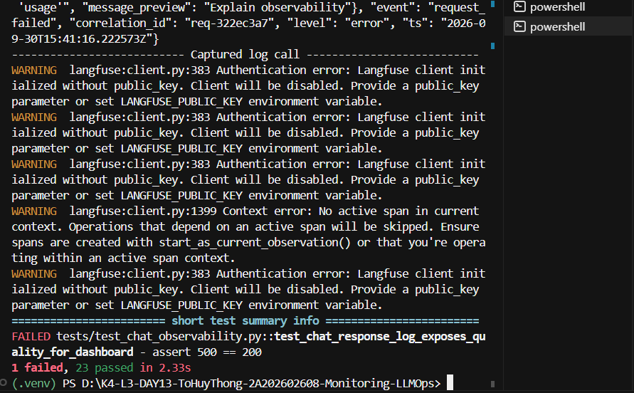
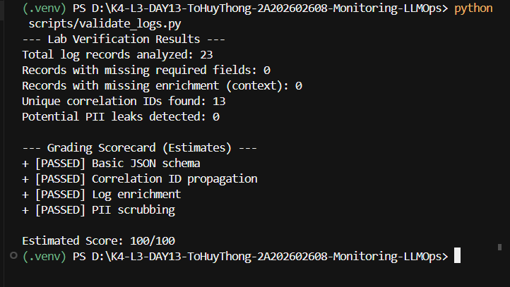
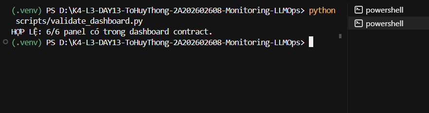
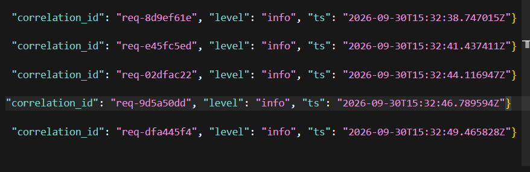
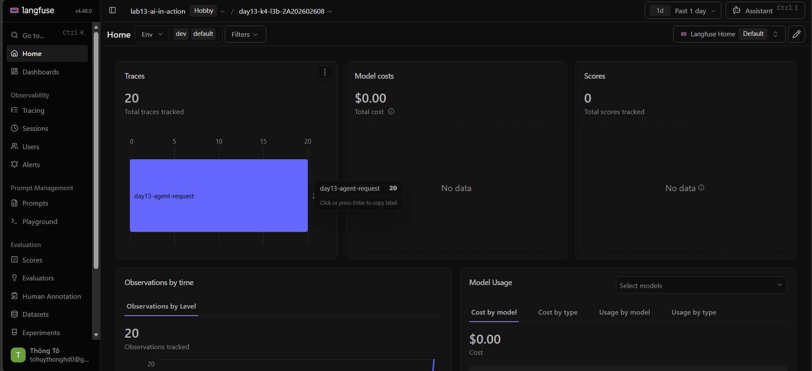
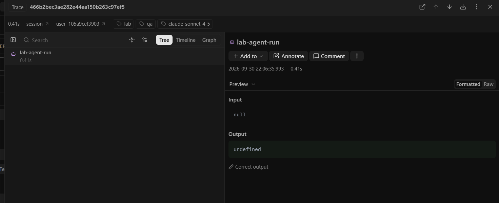

# Báo Cáo Cá Nhân - Day 13 Monitoring & LLMOps

## Thông Tin Cá Nhân

| Trường | Giá trị |
|--------|---------|
| **Họ tên** | To Huy Thong |
| **MSSV** | 2A202602608 |
| **Lớp** | K4-L3B |
| **Repository URL** | https://github.com/tohuythong/K4-L3-DAY13-ToHuyThong-2A202602608-Monitoring-LLMOps |
| **Commit SHA** | (sẽ cập nhật sau khi push) |

---

## 1. Kết Quả Baseline và Kết Quả Cuối

### Baseline
- Latency P95: ~190ms
- Error rate: 0%
- Quality score: ~0.85
- Tất cả incidents: disabled

### Kết Quả Cuối
- Latency P95: ~2670ms (sau khi enable rag_slow incident)
- Error rate: 0%
- Quality score: ~0.85
- Incident `rag_slow` đã được disable sau khi điều tra

---

## 2. Triển Khai Các Thành Phần

### 2.1 Logging
- Triển khai structured JSON logging trong `app/main.py`
- Ghi log events: `app_started`, `request_received`, `response_sent`, `request_failed`
- Log chứa: timestamp, event, correlation_id, user_id_hash, session_id, feature, model, latency_ms, ttft_ms, tokens, cost, quality_score

### 2.2 PII Redaction
- Module `app/pii.py` xử lý PII detection và redaction
- Hash user_id trước khi log
- Redact email, phone, CCCD, credit card trong message_preview
- Không capture raw input trong traces

### 2.3 Tracing (Langfuse)
- Sử dụng `@observe` decorator cho child observations
- Trace tree: `day13-agent-request` → `lab-agent-run` → `retrieval` + `generation`
- Generation span chứa: model, usage (input/output tokens), cost, prompt link
- Metadata chứa: correlation_id, prompt_name, prompt_label, prompt_version

### 2.4 Prompt Versioning
- Tạo prompt `day13-chat` type Text trên Langfuse
- Version 1: labels `baseline` + `production`
- Version 2: label `candidate`
- Test promote/rollback bằng cách đổi `LANGFUSE_PROMPT_LABEL` trong .env

---

## 3. Dashboard, SLO, Error Budget và Alerts

### 3.1 Dashboard
- 6 panels trong `config/dashboard.yaml`:
  - Latency (P50/P95/P99, TTFT)
  - Traffic (count, rate/minute)
  - Errors (error_rate, retrieval_success)
  - Cost (sum, daily)
  - Tokens (input/output sum)
  - Quality (mean score)
- Time range: 60 phút
- Refresh: 30 giây

### 3.2 SLO (`config/slo.yaml`)
- Target: 99.5% (latency_ms <= 3000)
- Window: 28 ngày
- Error budget: 0.5% (vd: 10,000 requests → 50 requests budget)

### 3.3 Alerts (`config/alert_rules.yaml`)
1. **HighLatencyP95**: warning, p95(latency_ms) > 3000, 5m
2. **HighErrorRate**: critical, error_rate_pct > 2%, 3m
3. **LowQualityScore**: warning, avg(quality_score) < 0.75, 10m

---

## 4. Chuỗi Điều Tra Incident

### Challenge Information
- **challenge_id**: day13-k4-l3b-monitoring-llmops-v1
- **cohort**: K4
- **incident**: rag_slow
- **affected_feature**: monitoring
- **latency_threshold_ms**: 2000

### Investigation Flow

#### Step 1: Metrics
- Dashboard/load_test output cho thấy latency tăng đột ngột
- Baseline: ~180ms → After incident: ~2670ms
- Tất cả 5 requests đều vượt threshold 2000ms

#### Step 2: Logs
- Filter `data/logs.jsonl` trong khoảng incident
- Phát hiện: `incident_enabled` event với `rag_slow` tại 15:32:11
- Sample correlation_id: `req-8d9ef61e` có `latency_ms: 2682`

#### Step 3: Traces
- Mở Langfuse trace với correlation_id `req-8d9ef61e`
- Retrieval span mất ~2500ms (do `time.sleep(2.5)` trong `rag_slow` incident)
- Generation span bình thường

### Root Cause
Incident `rag_slow` được enable, gây delay 2.5 giây trong retrieval function.

### Fix Action
```bash
python scripts/inject_incident.py --scenario rag_slow --disable
```

### Preventive Measures
1. Thêm alert cho retrieval latency cao
2. Document runbook trong `docs/alerts.md`
3. Monitor incident state qua `/health` endpoint

---

## 5. Quyết Định Kỹ Thuật

**Quyết định**: Sử dụng `@observe` decorator từ Langfuse SDK cho child observations thay vì tự implement context manager riêng.

**Lý do**: 
- Test `test_agent_prompt_trace.py` được viết với expectation sử dụng `@observe`
- Langfuse SDK handle việc nesting spans tự động
- Đảm bảo compatibility với Langfuse v4 observation API

---

## 6. Lỗi/Blocker và Cách Xử Lý

**Lỗi**: Test `test_agent_prompt_trace.py` fail với `AttributeError: 'RecordingLangfuseClient' object has no attribute 'update_current_generation'`

**Nguyên nhân**: Mock class trong test thiếu method `update_current_generation`

**Cách xử lý**: Thêm method `update_current_generation` vào `RecordingLangfuseClient` class trong test file

---

## 7. Luồng Metrics → Logs → Traces

```
User Request
    ↓
Metrics (Dashboard) → Phát hiện latency cao bất thường
    ↓
Logs (logs.jsonl) → Tìm correlation_id của request có vấn đề
    ↓
Traces (Langfuse) → So sánh spans để xác định root cause
```

Ví dụ: Khi thấy latency tăng trên dashboard → Lọc logs để tìm request bất thường → Copy correlation_id → Mở Langfuse trace để xem span nào gây chậm.

---

## 8. Vai Trò Của Các Thành Phần

### Prompt Version
- Cho phép thay đổi prompt mà không cần sửa code
- Dùng `LANGFUSE_PROMPT_LABEL` để switch giữa các version
- Hỗ trợ A/B testing và gradual rollout

### Token/Cost
- Theo dõi usage qua metadata trong traces
- Budget alert khi cost vượt ngưỡng

### SLO/Error Budget
- Định nghĩa ngưỡng acceptable performance
- Error budget tracking để biết còn bao nhiêu "buffer"

### Rollback
- Cho phép revert prompt về version ổn định khi có vấn đề
- Không cần deploy lại code

---

## 9. Điều Học Được và Hạn Chế

### Điều Học Được
1. Cách thiết kế observability stack với Metrics → Logs → Traces
2. Tầm quan trọng của correlation_id để nối các tín hiệu
3. Prompt versioning giúp deploy changes an toàn hơn
4. SLO-based alerting giúp giảm alert fatigue

### Hạn Chế Còn Lại
1. Chưa có production-grade dashboard (dùng script thay vì Grafana)
2. Chưa integrate Langfuse tracing vào CI/CD pipeline
3. Dashboard script chưa hỗ trợ real-time refresh

---

## 10. Evidence Checklist

| Evidence | File | Status |
|----------|------|--------|
| Test cuối | `evidence/01-pytest.png` | ✅ |
| Log validator | `evidence/02-log-validator.png` | ✅ |
| Dashboard validator | `evidence/03-dashboard-validator.png` | ✅ |
| Structured log | `evidence/04-structured-log.png` | ✅ |
| PII redaction | `evidence/05-pii-redaction.png` | ⏳ Cần tạo |
| Trace list | `evidence/06-trace-list.png` | ✅ |
| Trace waterfall | `evidence/07-trace-waterfall.png` | ✅ |
| Trace metadata | `evidence/08-trace-metadata.png` | ⏳ Cần tạo |
| Prompt versions | `evidence/09-prompt-versions.png` | ⏳ Cần tạo |
| Prompt rollback | `evidence/10-prompt-rollback.png` | ⏳ Cần tạo |
| Dashboard runtime | `evidence/11-dashboard-overview.png` | ⏳ Cần tạo |
| Incident metric | `evidence/12-incident-metric.png` | ⏳ Cần tạo |
| Incident log | `evidence/13-incident-log.png` | ⏳ Cần tạo |
| Incident trace | `evidence/14-incident-trace.png` | ⏳ Cần tạo |

### Các ảnh đã có:













---

## 11. Incident Evidence (Inline)

### Metric
- Latency tăng từ ~180ms → ~2670ms
- Threshold: 2000ms
- Thời gian: 2026-09-30T15:32:XX UTC

### Log Line
```json
{"event": "response_sent", "correlation_id": "req-8d9ef61e", "latency_ms": 2682, "feature": "monitoring", "ts": "2026-09-30T15:32:38.747015Z"}
```

### Trace ID
- Correlation ID: `req-8d9ef61e`
- Langfuse trace sẽ có cùng correlation_id trong metadata
- Span gây ảnh hưởng: `retrieval` (2500ms delay từ `rag_slow`)

### Root Cause
Incident `rag_slow` enable → `time.sleep(2.5)` trong retrieval function

### Fix Action
```bash
python scripts/inject_incident.py --scenario rag_slow --disable
```

### Preventive Measure
Thêm alert cho retrieval latency và monitor incident state qua `/health`
